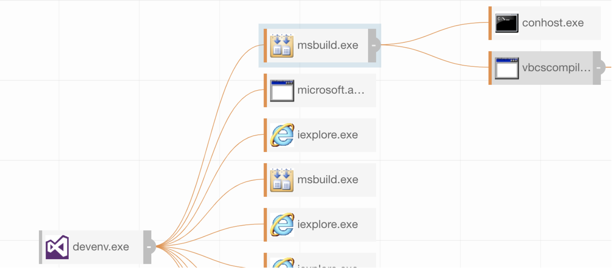
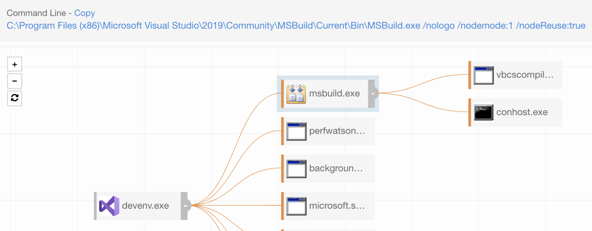
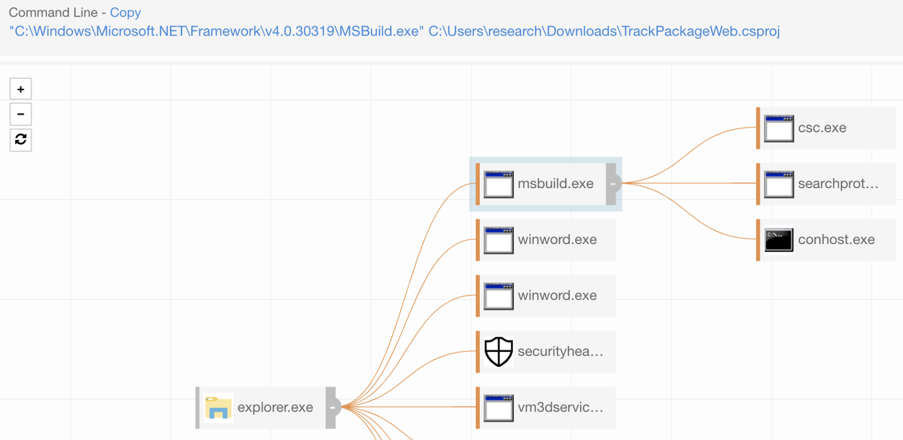

# MSBuild

This is a collection of detection techniques and information for blue teams on how to better detect abuse of [Trusted Developer Tools](https://attack.mitre.org/techniques/T1127/) - or MSBuild.exe.

All queries are in CarbonBlack Response, but are easily converted to Sysmon or other EDR products by matching fields.

Netconn or remote retrieval:
`process_name:msbuild.exe (cmdline:http OR cmdline:https)`

`process_name:msbuild.exe netconn_count:[1 TO *]`

Spawning off something:

`parent_name:wmiprvse.exe process_name:msbuild.exe`

`parent_name:mshta.exe process_name:msbuild.exe`

MsBuild spawning directly off Explorer is highly suspect:
`parent_name:explorer.exe process_name:msbuild.exe`

Inline tasks:
`process_name:msbuild.exe (modload:microsoft.build.tasks.v4.0.dll OR modload:microsoft.build.tasks.v4.0.ni.dll)`

`process_name:msbuild.exe digsig_result_modload:Unsigned parent_name:cmd.exe`

`process_name:msbuild.exe crossproc_name:notepad.exe`

Interactive use of MsBuild:
`process_name:msbuild.exe (parent_name:powershell.exe OR parent_name:cmd.exe)`

Injecting into something:
`process_name:msbuild.exe AND crossproc_type:"remotethread"`

## Normal / Not Normal

A key point about MsBuild is how it looks from the use of a developer compared to an adversary.

Normal:

It's also normal at times to see these being ran via powershell or cmd, similar looking cmdline.

Not Normal:

## Other Ideas

- Is it normal for dev's to write/execute `.csproj` out of non-standard paths? `\appdata\local` `\appdata\roaming\` `\programdata\` `\downloads\`

- Monitor for non standard file extensions on the command line (`.txt`,`.template`) loaded by MsBuild.

- Is it normal for an Office product to write a `.csproj` (or renamed `.csproj`) file to disk?

- Note that, you should monitor for renamed msbuild on all of these.

## Projects / References

- https://www.github.com/trustedsec/nps_payload
- https://github.com/rvrsh3ll/MSBuildAPICaller
- https://github.com/rapid7/metasploit-framework/blob/master/documentation/modules/evasion/windows/applocker_evasion_msbuild.md
- https://github.com/re4lity/subTee-gits-backups/blob/master/msbuildQueueAPC.csproj
- https://github.com/redcanaryco/atomic-red-team/blob/a956d4640f9186a7bd36d16a63f6d39433af5f1d/atomics/T1127/T1127.md
- https://github.com/Neo23x0/sigma/blob/cf22e9e576e8bfd92e74693dc53fe101b9bb0af1/rules/windows/process_creation/win_possible_applocker_bypass.yml
- https://lolbas-project.github.io/lolbas/Binaries/Msbuild/
- https://github.com/veramine/Detections/wiki/MSBuild
